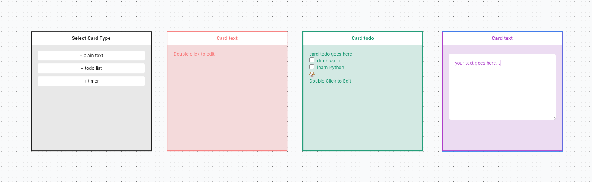

### utab - your own new tab

utilities included as openning new tab:

- [x] override new tab
- [x] draw or note (tldraw)
- [x] enable focus mode on popup
- [ ] add daisy ui or react aria?
- [ ] tiptap
- [ ] implement widgets:
  - [x] plain text
  - [ ] world clock
  - [ ] to do list
- [ ] custome background (static or dynamic)

### vibe code

see: CLAUDE.md

- [x] refactor current src code into monorepo
- [ ] add web app integration for preview deployment

### demo

create cards on your new tab:

on full browser:

### credit

- extension template from https://github.com/JohnBra/vite-web-extension
- infinite canvas from https://github.com/tldraw/tldraw
